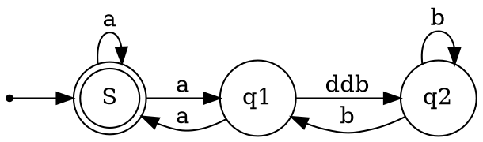
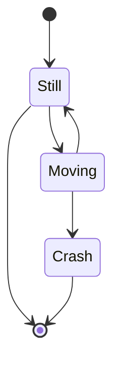
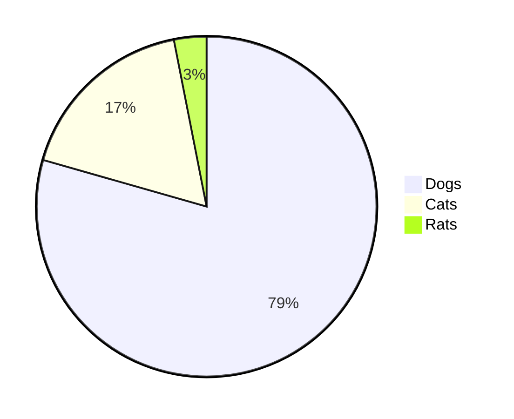
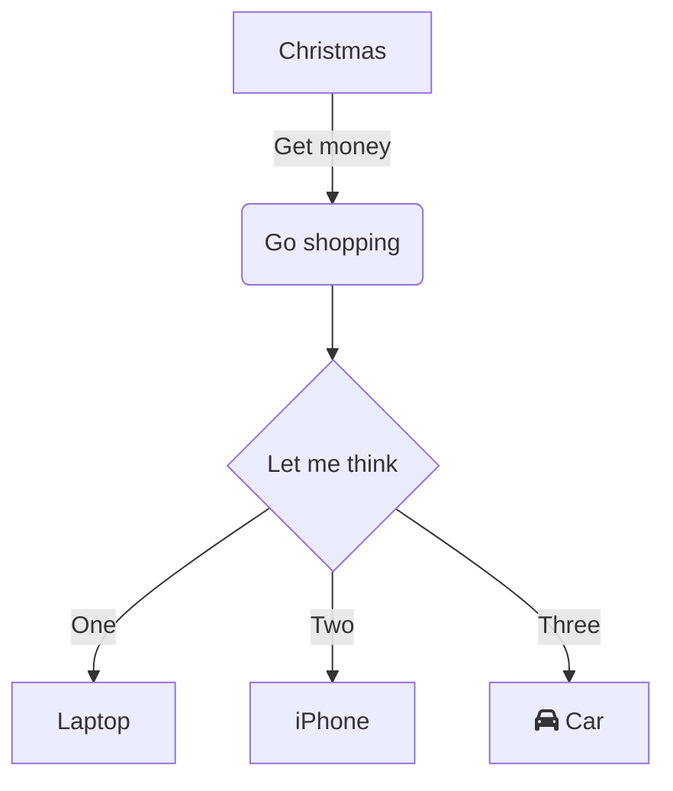
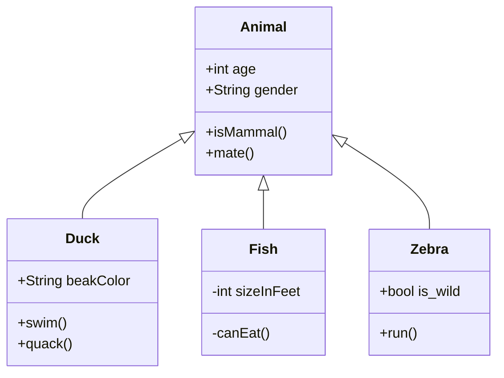
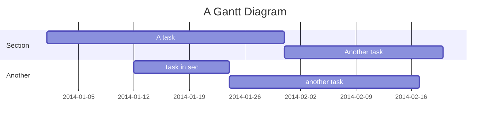

---

title: Test codiMD
summary: je fais un premier test de l'appli CodiMD
tags: collaboratif
robots: noindex, nofollow
authors:
    - Franck CHAMBON
    - Toi AUSSI...
date: 2020-05-17
lang: fr-FR

---

# Premier test

- [x] frontmatter en YAML
- [x] $\boxed{\varphi=\frac{1+\sqrt{5}}{2}}$ et $n!\approx \sigma\sqrt{2\pi n} \times n^n\times e^{-n}$
- [x] math en ligne et en bloc
- [x] ***emphases*** _faibles_ et __fortes__
- [x] `chasse fixe`
- [x] enchaînement de liste
- [x] case cliquable en sus
- [x]  :smile: et font awesome <i class="fa fa-address-book" aria-hidden="true"></i>, <i class="fa fa-book" aria-hidden="true"></i>
- [x] correction orthographique (non ?), **si** via grammalecte du navigateur, mais pas très pratique
- [x] H~2~O, sub
- [x] H^+^, sup
- [ ] H^+^~2~ ou H~2~^+^ (sup et sub)
- [x] ++inséré++
- [x] ~~supprimé~~
- [x] ==feutré==
- [x] Mode présentation (slides)
- [x] auto TOC (table des matières)
- [x] Graphiques
- [x] notes de bas de page
- [x] citations, et avec signature en option
- [x] substitutions typographiques, *cf infra*
- [x] définitions (sur plusieurs lignes)
- [x] Abrévations
- [x] coloration syntaxique (assez moyenne) du code
- [ ] **Mais** pas de coloration du code en ligne
- [x] tableau simple
- [ ] **mais** pas les pas les tableaux groupés (https://squidfunk.github.io/mkdocs-material/extensions/codehilite/#grouping-code-blocks)


## Tests

```
### Typographic Replacements

Enable typographer option to see result.

(c) (C) (r) (R) (tm) (TM) (p) (P) +-

test.. test... test..... test?..... test!....

!!!!!! ???? ,,

Remarkable -- awesome

"Smartypants, double quotes"

'Smartypants, single quotes'
```

### Typographic Replacements

Enable typographer option to see result.

(c) (C) (r) (R) (tm) (TM) (p) (P) +-

test.. test... test..... test?..... test!....

!!!!!! ???? ,,

Remarkable -- awesome

"Smartypants, double quotes"

'Smartypants, single quotes'


### Citations

> Citation simple...
> > ... imbriquée.

mais aussi

> Avec  **name, time et color** on peut varier le style.
> [name=Franck CHAMBON] [time=Dimanche 17 mai 2020] [color=#907bf7]


### codes
 
```python=
# tests coloration syntaxique ; c'est très sommaire
import sys
print(sys.version)
print(f"Salut à tous {42}")
for _ in range(0):
    pass
```

### boîtes

:::success
:clap: **Astuce**
Les boîtes colorées sont particulièrement pratiques à utiliser !!!
:::

>    :::spoiler :rocket: **Attention au spoiler** - clique-moi
>    :warning: 
>    :::warning
>    ```python=
>    print([[0]*10]*10, "c'est mal")
>    ```
>    :::

### Graphiques

#### Flow Chart


(avec cases cliquable)

```flow
st=>start: Start|past:>http://www.google.com[blank]
e=>end: End|future:>http://www.google.com
op1=>operation: My Operation|past
op2=>operation: Stuff|current
sub1=>subroutine: My Subroutine|invalid
cond=>condition: Yes
or No?|approved:>http://www.google.com
c2=>condition: Good idea|rejected
io=>inputoutput: catch something...|future

st->op1(right)->cond
cond(yes, right)->c2
cond(no)->sub1(left)->op1
c2(yes)->io->e
c2(no)->op2->e
```


#### Enchaînement

```sequence
Andrew->China: Says Hello
Note right of China: China thinks\nabout it
China-->Andrew: How are you?
Andrew->>China: I am good thanks!
```

#### Graphviz


##### Automate 1


```

#### Mermaid

##### Automate 2



##### Diagramme circulaire



##### Arbre



##### classe



##### Gantt


